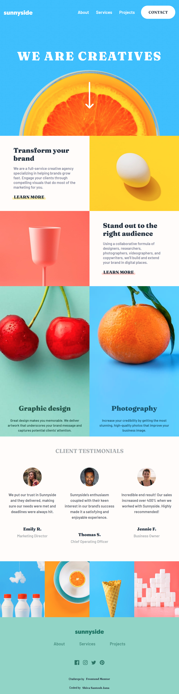

# Frontend Mentor - Sunnyside agency landing page solution

This is a solution to the [Sunnyside agency landing page challenge on Frontend Mentor](https://www.frontendmentor.io/challenges/sunnyside-agency-landing-page-7yVs3B6ef). Frontend Mentor challenges help you improve your coding skills by building realistic projects.

## Table of contents

- [Overview](#overview)
  - [The challenge](#the-challenge)
  - [Screenshots](#screenshots)
  - [Links](#links)
- [My process](#my-process)
  - [Built with](#built-with)
  - [Useful resources](#useful-resources)
- [Author](#author)

## Overview

### The challenge

Users should be able to:

- View the optimal layout for the site depending on their device's screen size
- See hover states for all interactive elements on the page

### Screenshots

Desktop version

Tablet version

Mobile version

### Links

- Solution URL: [Code on GitHub](https://github.com/santu369/frontendmentor-sunnyside-agency-landing-page)
- Live Site URL: [Netlify Live URL](https://santu369-frontendmentor-sunnyside-agency-landing-page.netlify.app/)

## My process

### Built with

- Semantic HTML5 markup
- CSS custom properties
- Flexbox
- Css Grid
- Mobile-first workflow
- BEM Methodology
- SASS
- Bootstrap
- React
- CSS Animations

### What I learned

Creating Hamburger menu from scratch without using any images.

### Useful resources

- [Sass](https://sass-lang.com/) - Installing and Learning Sass.
- [BEM](https://en.bem.info/methodology/quick-start/) - Quick Start with BEM.
- [W3C Markup Validation Service](https://validator.w3.org/) - Validator for checking the markup validity of Web documents in HTML, XHTML, SMIL, MathML, etc.
- [W3C CSS Validation Service](https://jigsaw.w3.org/css-validator/) - Check Cascading Style Sheets (CSS) and (X)HTML documents with style sheets.
- [Bootstrap CSS](https://getbootstrap.com/docs/5.0/getting-started/introduction/) - Getting started with Bootstrap.
- [React](https://reactjs.org/) - Javascript library for building interfaces.

## Author

- Website - [Shiva Santosh Jana](https://santu369.github.io/FreeCodeCamp-PersonalPortfolioWebpage)
- Frontend Mentor - [@santu369](https://www.frontendmentor.io/profile/santu369)
- Twitter - [@santu69](https://www.twitter.com/santu69)
